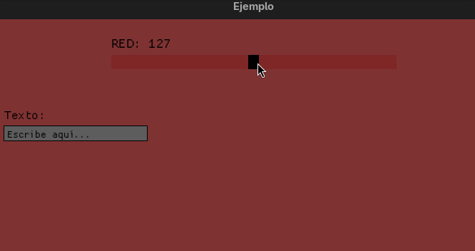

# Macroquad Components :bar_chart:  
  

  

## ¿Cual es la utilidad de este proyecto? ⁉️
Este es mi primer pequeño proyecto desarrollado en Rust, como parte de un proyecto mayor.  
El caso es que necesitaba utilizar sliders para controlar el volumen y... el que ofrece macroquad no me pareció especialmente bonito. Asi que si algo no te gusta... ¡crea tu propia versión!  
Aún hay mucho que pulir, poco a poco ire mejorando los componentes conforme vaya encontrando sus limites en diferentes proyectos o si recibo algún tipo de feedback.  
El proyecto crece según voy necesitando componentes para mi proyecto principal, así que pasa a llamarse Macroquad Components, ya que va a englobar los diferentes componentes que vaya desarrollando para mis proyectos dentro del ecosistema de Macroquad.  

## Cómo usar la crate :gear:
Clona este repositorio:  
```
git clone https://github.com/HectorCRM/Macroquad-Components.git
```

Abre el Cargo.toml del proyecto en el que quieras utilizarlo y añade:
```
[dependencies]
mq_components = { path = "/ruta del crate en tu máquina/mq_components" }
```

Luego incluyelo en tu proyecto el componente o componentes que necesites:
```rust
use mq_components::slider::Slider;
use mq_components::text_field::*;
```

## Ejemplos
### Slider

Una vez importado el módulo, debes contar con una variable de tipo **mut** sobre la cual trabajará el slider. En el gif de ejemplo trabaja con el canal rojo del color RGB:
```rust
let mut color: f32 = 127.0;
```

Despues construimos el slider:
```rust
let mut slider: Slider = Slider::nuevo_slider(
	nombre_etiqueta,
	metrica,
	posicion_y,
	ancho_barra,
	alto, valor,
	valor_minimo,
	valor_maximo,
	color_barra,
	color_slider);
```
Explicación de los parametros:  
 - **nombre_etiqueta:** El nombre que se mostrará sobre el slider en pantalla, en el ejemplo "Volumen"
 - **metrica:** Hace referencia al tipo de dato con el que estamos trabajando, **%** en el ejemplo. Puede dejarse vacia("") si no queremos mostrar nada.
 - **posicion_y:** Posición del slider en el eje vertical de la pantalla.
 - **ancho_barra:** Anchura que ocupará el slider en pantalla.
 - **alto:** Altura en px que tendrán en pantalla la barra del slider y el propio slider.
 - **valor:** El valor o variable que queremos modificar con el slider.
 - **valor_minimo:** Valor minimo deseado para la variable con la que vamos a trabajar, es importante establecerlo para poder mapear el valor a pixeles al renderizar el slider.
 - **valor_maximo:** Idem, pero para el limirte superior del valor de la variable.
 - **color_barra:** Color deseado para la barra del slider.
 - **color_slider:** Color deseado para el slider y la etiqueta sobre este.  
 
Y ya podemos usarlo dentro del loop:
```rust
slider.pintar_slider(color);
color = slider.mover_slider(color);
```  

### Text Field
Una vez importado el módulo, debes crear una lista para el campo o campos de texto:
```rust
let mut lista: ListaTextFields = ListaTextFields::nuevo();
```
Hecho esto ya puedes añadir a la lista los diferentes componentes TextField que necesites:
```rust
lista.agregar(TextField::text_field(
	x,
	y,
	ancho,
	alto,
	color_fondo,
	color_texto,
	etiqueta,
	place_holder));
```
Explicación de los parametros: 
 - **x:** Es la posicion en que se rendirzará el campo de texto en el eje x(horizontal).
 - **y:** Es la posicion en que se rendirzará el campo de texto en el eje y(vertical). La etiqueta se pintará encima automáticamente.
 - **ancho:** Anchura del campo de texto en px. Hay que tener en cuenta cuantos caracteres esperamos en el input, ya que estan limitados para no desbordar la anchura del componente.
 - **alto:** Altura en px del campo de texto. A partir de este parametro se calcula el tamaño de la fuente de forma automatica.
 - **color_fondo:** Color de fondo del componente. Por defecto sera gris si el componente no tiene el foco.
 - **color_texto:** Color del texto.
 - **etiqueta:** Cadena para indicar que input se espera(nombre, descripcion...).
 - **place_holder:** Este parametro es opcional. Si no quiere especificarse nada en concreto debe ponerse a None para que por defecto muestre ***"Escribe aquí..."***. Si se quiere especificar algo concreto debe ponerse ***Some("Cadena")***  

Hecho esto ya podria utilizarse dentro del loop:
```rust
text_field_list.actualizar_y_pintar();
```


## Requisitos :clipboard:
 - Git
 - Rustc

## Mejoras futuras :rocket:
 - Crear sliders verticales.  
 - Habilitar valores personalizados y diferentes métricas a los sliders. ✔️  
 - Desarrollar campos de entrada de texto. ✔️  
 
<!--
## Versiones :pushpin:
 [Ver CHANGELOG](./CHANGELOG.md) -->

